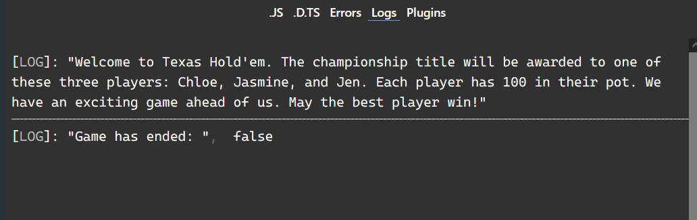
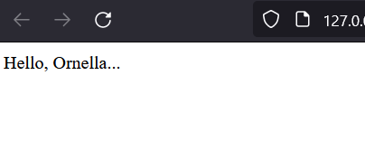
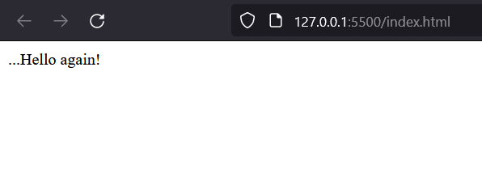
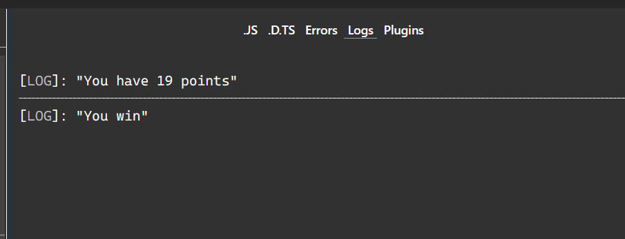
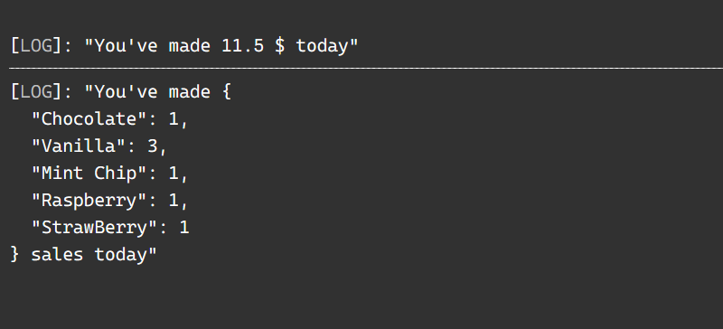
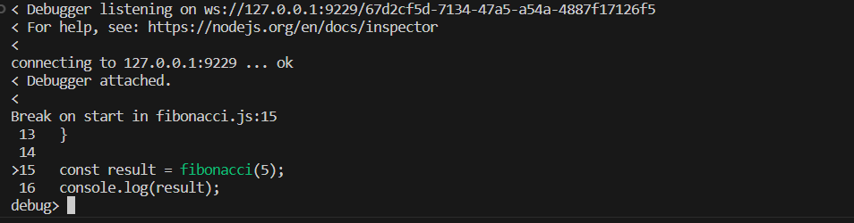
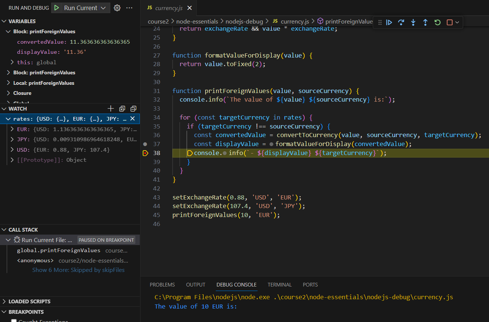
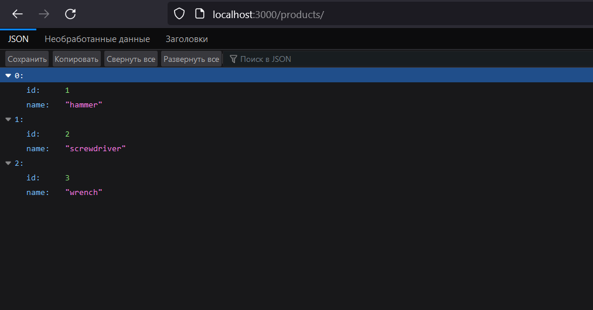

<h1 align=center>Отчёт по работе №1</h1>

## Цель

Изучение основ разработки на языке Javascript/Typescript.

## Задачи

- Пройти интерактивный курс microsoft “Веб-разработка для начинающих”;
- Пройти интерактивный курс microsoft “Создание приложений JavaScript с помощью Node.js”;
- Пройти интерактивный курс microsoft “Создание приложений JavaScript с помощью TypeScript”.

## Ход работы

### Веб-разработка для начинающих

Необходимо пройти интерактивный курс "Веб-разработка для начинающих."

Сначала необходимо выполнить упражнения с типами данных.

Результат выполнения представлен на следующем рисунке:

  
Рисунок 1. Результат упражнения с типами данных

Далее необходимо выполнить упражнение с созданием функции JavaScript.
Результат выполнения представлен на следующем рисунке.

  
Рисунок 2. Результат упражнения с функциями

Далее нужно выполнить упражнение с созданием анонимной функции.
Результат представлен на следующем рисунке.

  
Рисунок 3. Результат работы с анонимными функциями

Следующим шагом нужно выполнить упражнение с условными конструкциями.
Результат выполнения - на следующем рисунке.

  
Рисунок 4. Результат работы с условными конструкциями

Далее нужно выполнить упражнение с массивами и циклами.
Результат выполнения представлен на следующем рисунке.

  
Рисунок 5. Результат работы с массивами и циклами

### Создание приложений с помощью Node.js

Node.js предоставляет большой набор встроенных API, которые помогают создавать
различные типы приложений, приложения командной строки, веб-приложения и многое
другое. Он также предлагает возможности тестирования и отладки и обширную
экосистему пакетов сторонних разработчиков, которые можно легко добавлять в приложение.

Для начала необходимо установить `Node.js`, затем создать папку для проекта.
После этого с помощью команды `npm init` необходимо инициализировать новый проект.
В процессе инициализации создастся файл `package.json`.
В ходе выполнения первого упражнения получается следующая структура:

```json
{
  "name": "tailwind-trader-api",
  "version": "1.0.0",
  "description": "HTTP API to manage items from the Tailwind Traders database",
  "main": "index.js",
  "dependencies": {},
  "devDependencies": {},
  "scripts": {
    "test": "echo \"Error: no test specified\" && exit 1",
    "start": "node ./src/index.js"
  },
  "keywords": ["api", "database"],
  "author": "Sam",
  "license": "ISC"
}
```

В данной структуре описаны основные свойства проекта `Node.js`, такие как:

- Название;
- Описание;
- Автор;
- Точка входа.

Так же очень важные разделы - `dependencies` и `devDependencies`,
в которых описаны зависимости проекта. Еще один важный раздел - `scripts`.
В нём можно описать действия, которые можно выполнять автоматически по команде
`npm run`.
Далее необходимо склонировать учебный репозиторий `node-essentials`.
Все дальнейшие действия проходят в контексте данного репозитория.  
Необходимо выполнить упражнение по использованию встроенного отладчика `Node.js`.
Процесс использования отладчика представлен на следующем рисунке.

  
Рисунок 6. Использование встроенного отладчика

Далее необходимо воспользоваться отладчиком `Visual Studio Code`.
Процесс использования отладчика `Visual Studio Code` продемонстрирован
на следующем рисунке.

  
Рисунок 7. Использование отладчика VCS

Далее нужно создать простейшее веб-приложение с помощью библиотеки `Express.js`.
Результат работы веб-приложения - возврат сервером данных JSON -
представлен на следующем рисунке.

  
Рисунок 8. Результат работы простейшего приложения

Результат прохождения данного курса представлен на следующем рисунке.

  
Рисунок 9. Результат прохождения курса создания приложения

### Создание приложений Javascript с помощью Typescript

TypeScript предоставляет все возможности JavaScript, а также дополнительный
уровень — систему типов TypeScript. В этой схеме обучения показано,
как используя TypeScript для разработки JavaScript, можно создавать
более надежный код, сокращать ошибки типов среды выполнения,
использовать преимущества современных функций,
прежде чем они будут доступны в JavaScript, и оптимизировать работу с командами разработчиков.

Прежде всего необходимо установить компилятор TypeScript -
он будет автоматически переводить конструкции языка `TypeScript`
в конструкции языка `JavaScript`. Для установки нужно воспользоваться командой:

```bash
npm install -g tsc
```

После этого необходимо инициализировать проект `TypeScript` с помощью команды:

```bash
tsc --init
```

Данная команда создаст в проекте файл `tsconfig.json`, в котором описываются
параметры компилятора.
